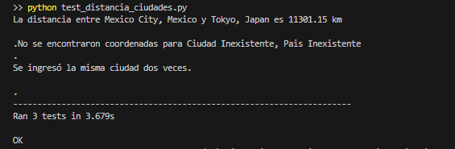

# Proyecto de Obtención de Coordenadas y Cálculo de Distancia

## Equipo de Contribución
- [Repositorio en GitHub](https://github.com/OmarUTEC/path_city.git)

## Pruebas Unitarias
Las pruebas fueron desarrolladas y ejecutadas en la carpeta [`test_distancia_ciudades`](./test_distancia_ciudades)

Además, se adjunta la imagen del resultado de las 3 pruebas realizadas:
1. Prueba de éxito donde se calculan correctamente las distancias entre dos ciudades existentes.
2. Prueba extrema donde una de las ciudades no existe.
3. Prueba extrema donde se ingresan la misma ciudad dos veces.



## Requisitos

- **MOCK**: No se requieren dependencias adicionales.
- **CSV**: No se requieren dependencias adicionales.
- **API**: Se requiere la biblioteca `requests`. Puedes instalarla utilizando el siguiente comando:
  ```bash
  pip install requests
## Configuración

Antes de ejecutar el programa, asegúrese de tener un archivo CSV con datos de ciudades llamado `worldcities.csv` en el mismo directorio que el archivo `main.py`. Si prefieres utilizar la API para obtener las coordenadas, no se requiere ninguna configuración adicional.

## Ejecución

Para ejecutar el programa, simplemente ejecuta el archivo `main.py` con Python desde la línea de comandos: 
 ```bash
python main.py